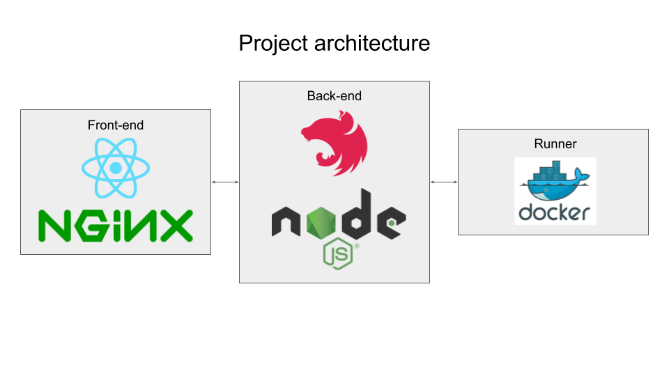
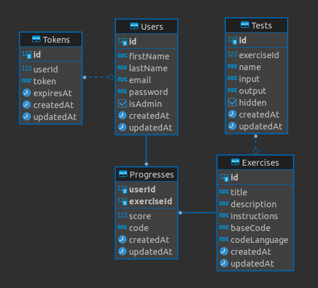

<br />
<div align="center">
  <a href="https://ascoz.fr">
    
  </a>

  <h3 align="center">A small coding learning app</h3>

  <p align="center">
    <a href="https://ascoz.fr">View website</a>
  </p>
</div>

## À propos du projet

Ce projet a été réalisé dans le cadre d'un cours de développement web.\
Il consiste à créer un site web permettant de s'exercer sur la programmation, en suivant des exercices définis.\
Cette partie ne concerne que le back-end de l'application. [Voir le front-end](https://github.com/Alexis-Bernard/polycode_frontend)

### Technologies utilisées

* [NestJS](https://nestjs.com/)
* [Sequelize](https://sequelize.org/)
* [Dockerode](https://github.com/apocas/dockerode)
* [TypeScript](https://www.typescriptlang.org/)
* [Passport.js](https://www.passportjs.org/)

## Installation

1. Clonez le projet sur votre machine.
   ```sh
   git clone https://github.com/Alexis-Bernard/polycode_backend.git
   ```
2. Installez les dépendances.
   ```sh
   npm install
   ```

## Utilisation

```bash
# development
$ npm run start

# watch mode
$ npm run start:dev

# production mode
$ npm run start:prod
```

## Architecture du projet

Voici un schéma représentant l'architecture technique du projet.\


Voici le schéma d'architexture de la base de données.\


## Choix des technologies

Certaines technologies utilisées dans ce projet étaient oblogatoires; d'autres ont été chosies par moi même.\
Pour celles non imposés, voici mes remarques positives et négatives.\
   * NestJS:
     * Positif : Simplicité d'utilisation, facilite la création d'un projet et l'ajout d'élements via la cli.
     * Négatif : Le framework est difficile à la comprehension au départ. De plus, le fait que tout fonctionne avec des décorateurs nous cache le réel fonctionnement de l'application.
   * Dockerode:
     * Positif : Pratique pour exécuter rapidement des containers docker sans trop s'embêter.
     * Négatif : La documentation est trop peu avancée, parfois on perd du temps sur des choses qui auraient pu être mieux expliquées
   * Sequelize:
     * Positif : Simplicité d'utilisation, facilite la création d'une base de données. De plus, je connaissait déjà cet outil.
     * Négatif : Je n'ai jamais utilisé d'autre ORM, il est difficile de donner des points négatifs là dessus..

## CI/CD
  * CI - GitHub actions:
    * Build app
    * Share artifacts
    * Build Dockerfile
    * Push to Dockerhub
  * CD - Docker Compose:
    * Nginx (as reverse-proxy)
    * Frontend
    * Backend
    * Postgres database

## Post mortem

Sur ce projet, j'ai beaucoup mieux géré mon temps. Cela m'a permis de mieux comprendre les frameworks que j'ai utilisé et de les mettre en place correctement.

Cependant, j'ai aussi pu faire des erreurs et des fautes :\
J'ai développé certaines parties dont je n'avais pas besoin (Tests sur les exercices, etc.), au dépend de ce que j'avais à faire.\
Ainsi mon projet n'a pas de tests unitaires, mais il est bien fonctionnel.

La méthode consistant à dé-risquer les parties moins inconnues à faire m'a permis de mieux gérer mon temps pour la suite.\
Cependant, certaines parties; comme la gestion des mails, n'a pas pu être développée.